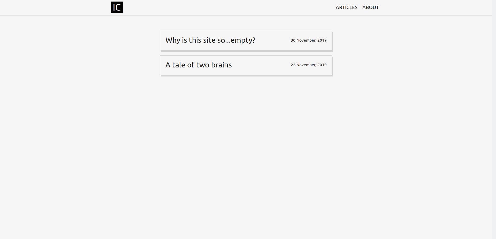
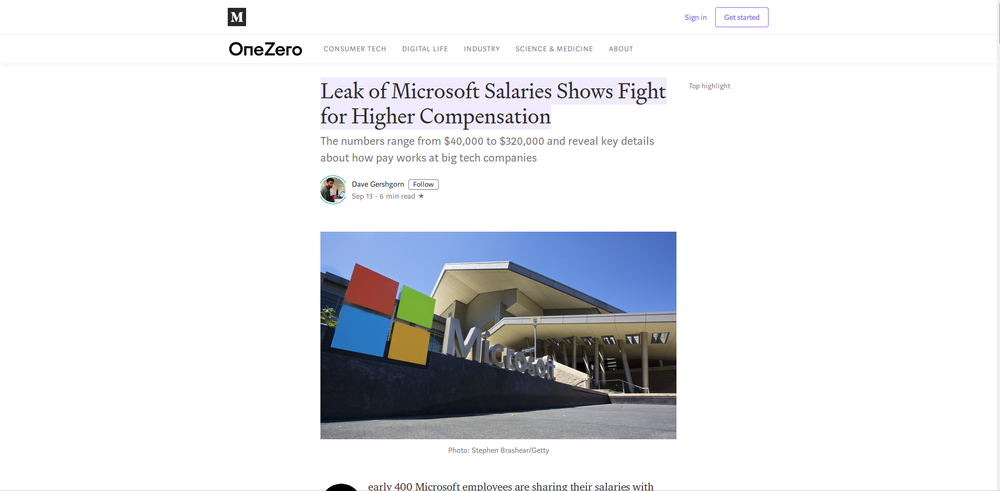

If future context is needed, here is the current homepage:

Lots of whitespace and some text.

The original plan for this site was very different. Bold, bright, splashy, attention grabbing, quirky animations, easter eggs... But the initial hours spent agonizing over color palettes and fonts convinced me that I was in over my head. I needed some design safety rails and prebuilt scaffolding.

Taking stock of the web content landscape we can find a few arbitrary categories:

- physical products (nike.com, apple.com)
- social media (instagram.com, reddit.com)
- news/blog content (washingtonpost.com, medium.com)

This site falls squarely into the blog (short for 'weblog'...huh) category. Let's take a look at Medium:

Almost nothing to it. The only design elements I see:
- title, author, date, other content metadata up top
- centered text, 40-60% width surrounded by white space
- sometimes a sidebar with suggested/related content
- images large and inline with the text
- more related content at footer

Medium has extracted the bare necessities for readable web content. If authors and platforms didn't need to be credited, then the only thing left on the page would be text and an occasional picture. Simple enough. Medium is still around so they must be doing something right.

So why not post on Medium? While it would be convenient, I like having control over the browsing experience. Currently, every Medium article has a login prompt popup and the homepage requires a login to even browse through its article titles. Other potentially irritating changes come and go, some good examples: https://medium.com/@nikitonsky/medium-is-a-poor-choice-for-blogging-bb0048d19133.

So here is the site. Text and sometimes a picture. Easy to implement, easy to read. I am using Gatsby for the static content and am hosting on a serverless solution - I will follow up with some technical details. There is something funny about using the latest in web and cloud technologies to develop and host what could be implemented as a static HTML page. But this setup should make it easier to experiment with functionality for the site later on. Maybe a color-changing content divider, or footnotes, or code snippets...