I have used saunas frequently over the last several years. One of my jobs in college was a swim and lifeguard instructor. Some days I would be in and out of the water for 6 hours at a time. The locker room sauna was my life raft, it got me through the cold between lessons. I continued to use saunas post college for joint pain relief (which I now believe was likely related to my [undiagnosed Crohn's disease](../crohns-hospitalization/)). There have been many studies investigating how regular sauna use may help improve health in several areas. But aside from the practical and health draws, I enjoy how it makes me feel. Following a long session up with a cold shower is a great buzz.

Unfortunately, most gym saunas in my area were closed during COVID. This got me thinking, wouldn't it be nice to have a home sauna? This wasn't realistic when I was living in and between apartments, but recently we moved and now have room for it. I looked online for pre-built options and got some sticker shock. The cheapest infrared models were around $2000. Most of the studies for health benefits used radiant heat (typically done with electric heaters and rocks) and the cheapest radiant one person sauna kit was around $3500. These kits have the advantage/disadvantage of being one size fits all. Unless we had a space that happened to match, they might look out of place.

We have a small corner in the basement that looked just big enough to fit two people and a heater. It is hard to imagine what else we would use the space for. Doing some mental math on the materials needed, I didn't see why a radiant sauna couldn't be built for around $1000. And if it is custom built to our corner, it can look like it belongs. Plus, I was feeling confident that working with straight lines would be a lot easier than with all the curves involved in the [van build](../van-build-why/) last year.

## Planning

I spent a few days measuring, re-measuring, and napkin drawing and decided to go for it based off some very crude blueprints.

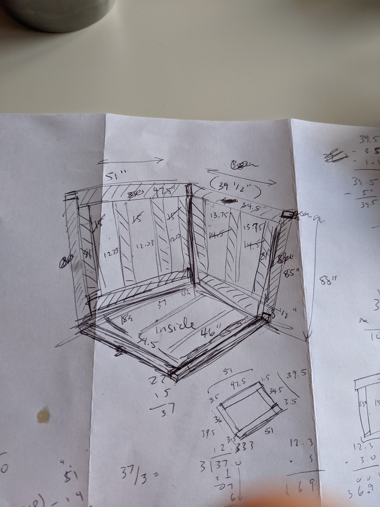

The plan was to build a frame on top of the existing corner in the basement and clad the interior with pine tongue and groove and the exterior with drywall painted the same color as the rest of the basement. At the end, it should look like a closet (with a secret sauna inside). 

I had some doubts that I would be able to pull this off in a way that looked professional. And I wasn't positive that there would be enough space to fit two people. It was going to be a very tight fit. So I left myself an out, I would build in a way that if it really didn't work, I would take everything apart and patch a few screw holes in the drywall. 

I ordered a **[2KW sauna](https://www.amazon.com/VEVOR-Mount-Steam-Sauna-Heater/dp/B07C2LJ665/ref=sr_1_3?crid=60Q38OISAQ6Z&keywords=vevor+sauna&qid=1640884171&sprefix=vevor+saun%2Caps%2C287&sr=8-3)** that claimed to be powerful enough to heat a 100 square foot space to 194F. The finished space for this would be about 80 square feet, so I figured this would be sufficient, especially as I planned to insulate thoroughly. I really wanted this sauna to work as it was very cheap (only ~$100) and could could run off a 20 amp wall outlet. As it happened, our basement outlets run off a 20 amp breaker so this worked perfectly, all I had to do was switch in a GFCI outlet. I tested the heater out before building anything and it seemed to get pretty hot. So I went on with the building...spoiler alert, it would prove to be not hot enough. 

## Framing

Here you can see the corner with the frame built on top of the existing wall. I would later remove the recessed light, but it was helpful while working on this part.

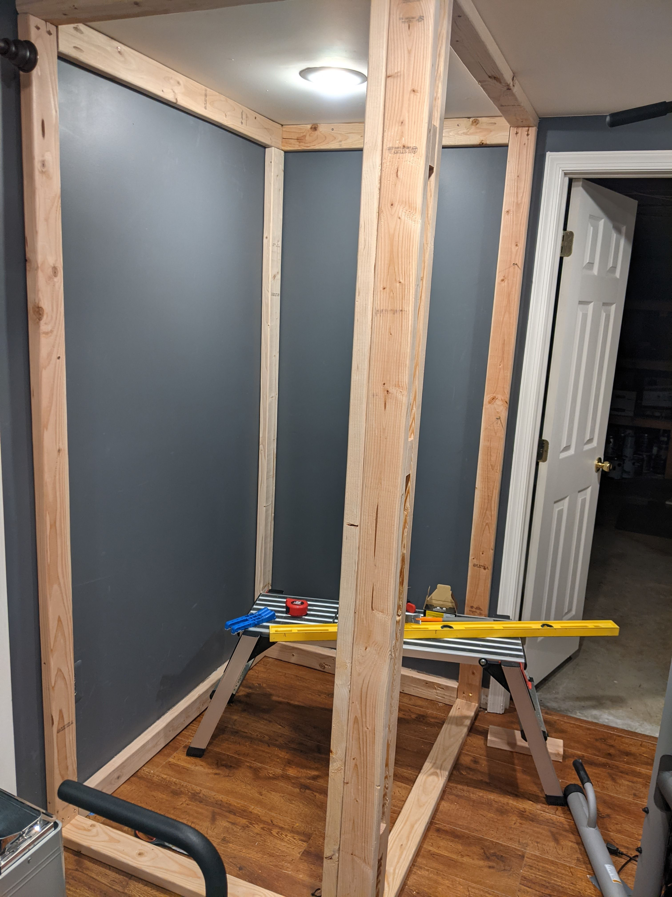

I played with a few places that the door could go, but ultimately decided on leaving off center to the left. I had an old door slab that I hoped to reuse. I got a YouTube education on door framing and left/right handed doors and door slabs vs. pre-hung doors. 

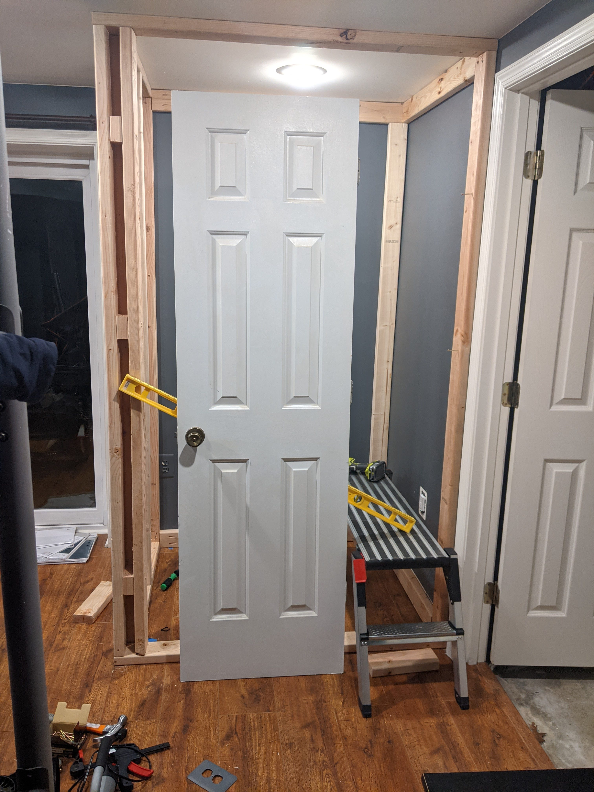

Once I knew where I wanted the door, I added supports for it in the frame. It happened nicely that I could start the door frame right where the corner support ended.

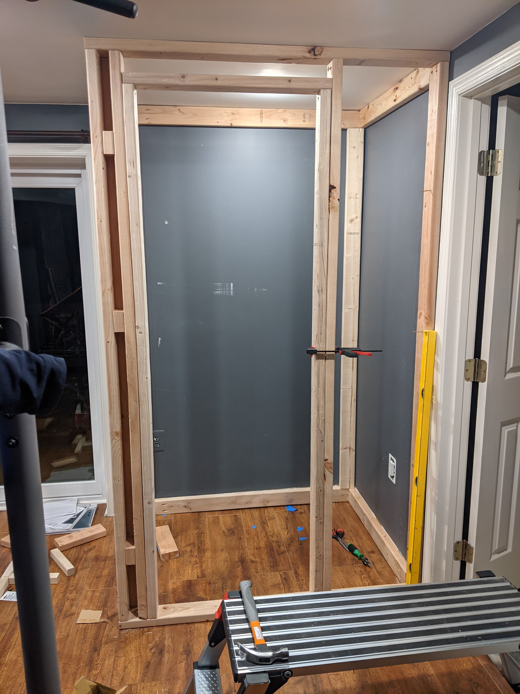

Adding frame for ceiling...

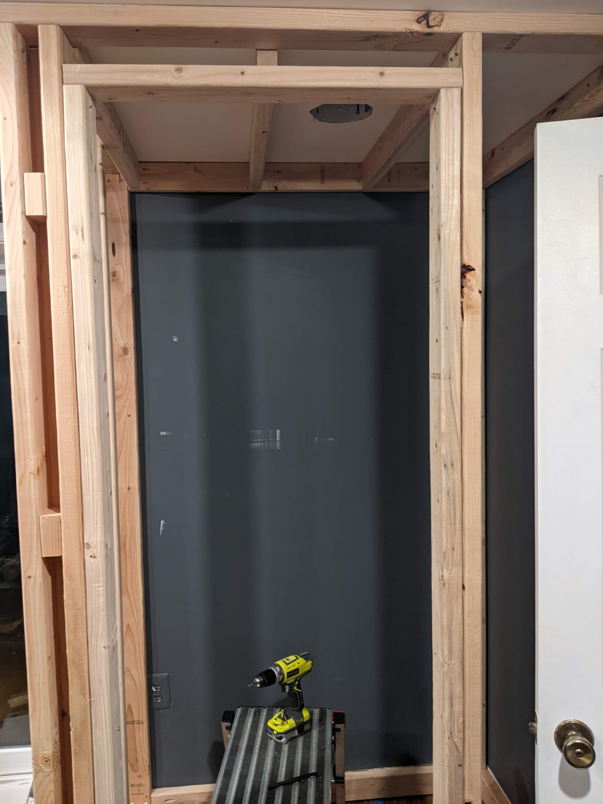

Adding frame on top of existing walls...at this point I should have just cut out the drywall.

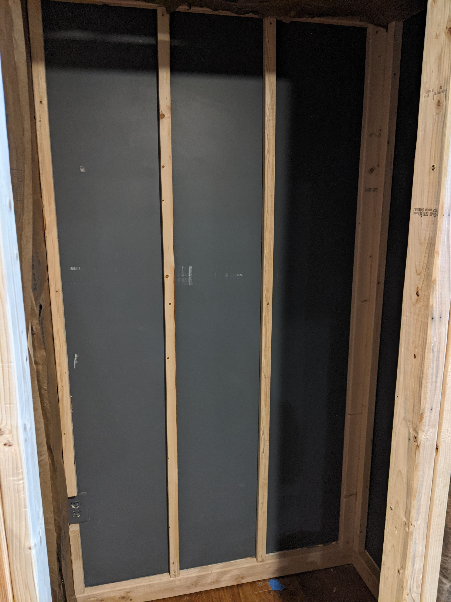

## Insulation & Vapor Barrier

I used R13 rockwool insulation for the new walls and the ceiling. One of the existing walls faced outside and I assumed there was already insulation behind it. The other existing wall faced towards an unfinished portion of the basement and I put insulation on that side rather than trying to squeeze it in on the inside. Getting the insulation to fit some of my nonstandard stud distances was a bit of a pain.

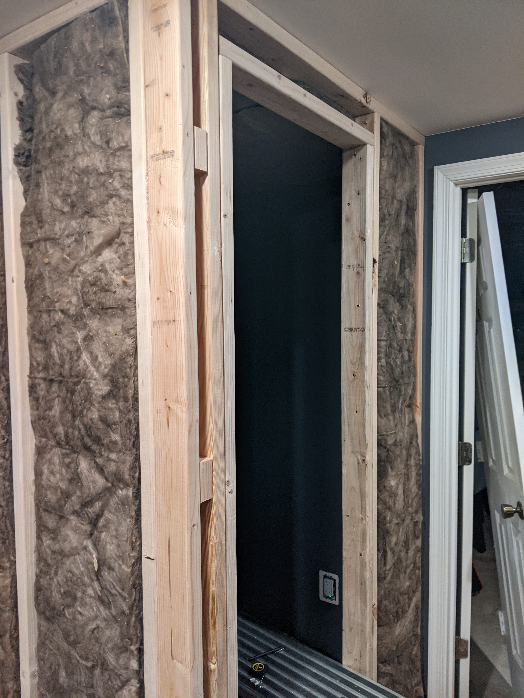

Next step was to add a vapor barrier. The vapor barrier does what it sounds like - prevent vapor/humidity from leaving the room and getting into the insulation and frame. It also helps keep the heat in. I used **[this foil](https://www.amazon.com/gp/product/B06ZYRB3TG/ref=ppx_yo_dt_b_asin_title_o09_s00?ie=UTF8&psc=1)** rather than Reflectix as Reflectix has some plastic in it that is not rated for temperatures above 180 degrees fahrenheit.

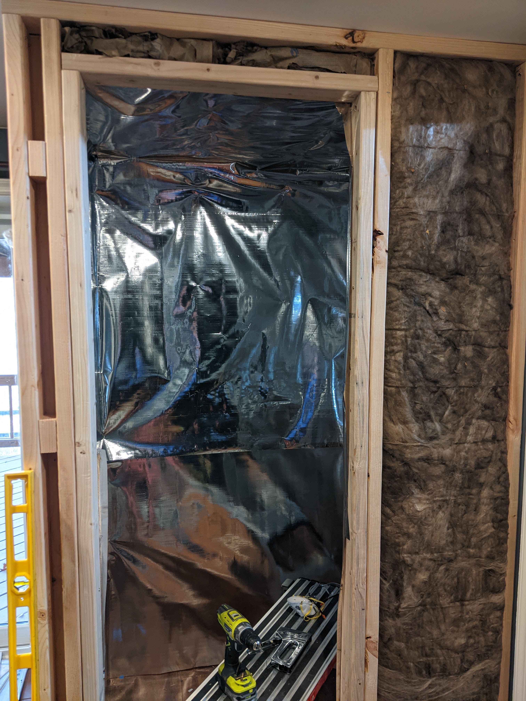

Getting the foil on without significant wrinkling and gaps required a lot of staples and swearing. I did it solo as H was out of town, but would wait for another person to help if I was doing it again.

## Drywall and door

The outside sections were *just* big enough that I needed two 4x8 sections of drywall. Thankfully, there were only two very small sections that needed tape. It was my first time doing drywall and I chickened out and did not tape the corners. One corner was so tight it would have been extremely difficult without removing the trim. But I was able to cut the drywall close enough that unless you look for it, it appears pretty seamless.

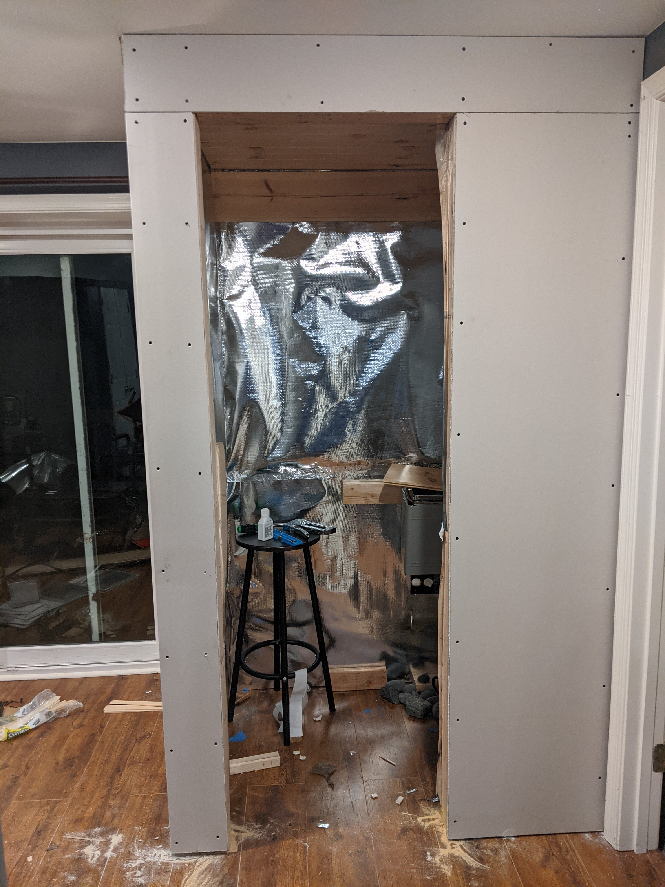

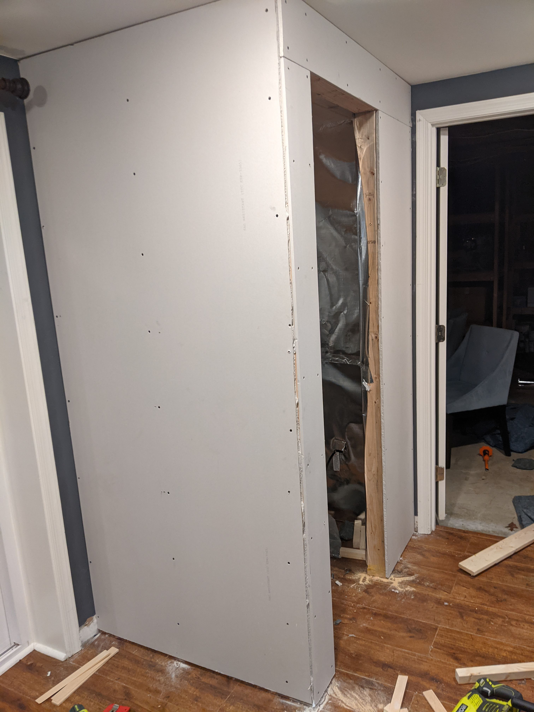

I installed the door frame after doing the drywall to make sure I could get it as flush as possible. I ended up making my own frame for the door by ripping 1x6s to width to match the widths of the 2x4 stud + the drywall + the tongue and groove planks. Getting the door in the frame was a bit tricky, but getting the frame in the studs turned out to be pretty easy as I had made sure the studs were level when putting them in.

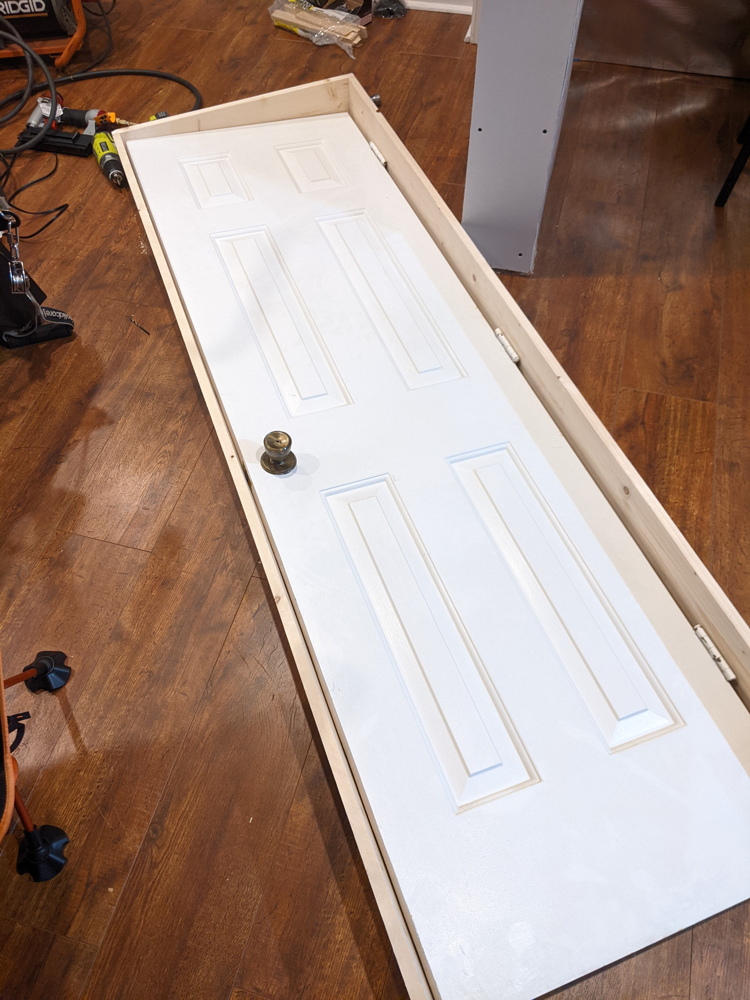

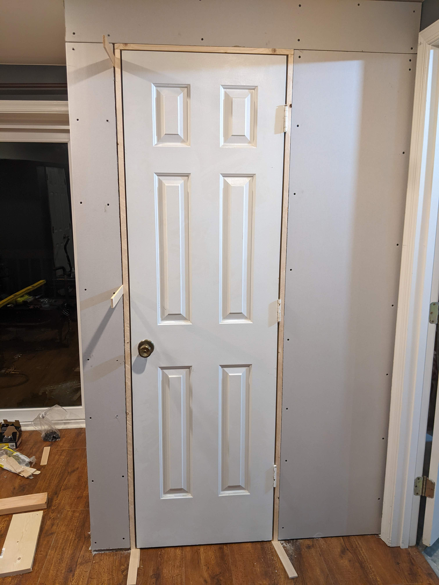

Once the door was in, I starting mudding the drywall. This went ok at first, but I quickly learned how unforgiving any small bump is. Most of the job was sanding, I think I got better at it by the end but could use a LOT more practice if I ever planned to do more than a small section again. 

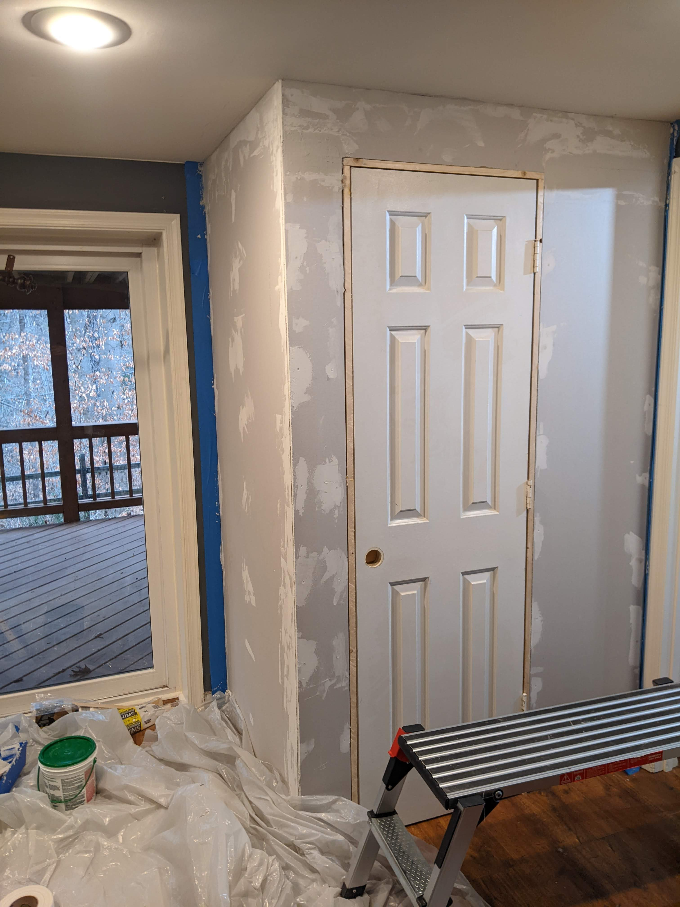

I glued and stapled a vinyl bead for the corner. Mudding this took a long time as I went on too thick and most of the process was sanding it down.

## Interior

I used pine tongue and groove for the interior. I ended up using about 22 eight foot boards for this, I probably could have used a few less if I had been more strategic about the cuts. It took a lot of measuring and cuts but was pretty straightforward after figuring out how long each side needed to be. The planks are attached with 18 gauge brad nails.

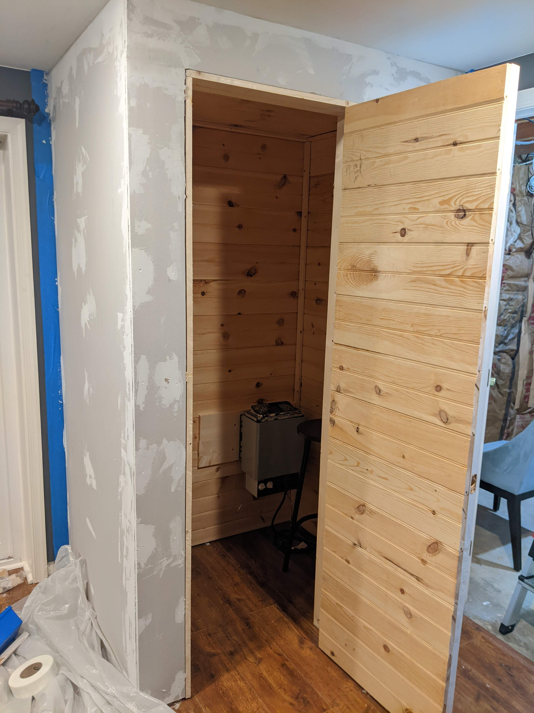

It was around this point that I discovered the 2KW sauna was not going to cut it. Even after some modifications to the thermometer placement, it just wouldn't get to the temperature I wanted (at least 180F). Unfortunately this meant I would need to get a much bigger **[6KW sauna](https://www.amazon.com/VEVOR-Mount-Steam-Sauna-Heater/dp/B07F68N5JD)** that takes up more room and requires a 240V input...which meant that I would have to install new wiring. I considered living with a lower temperature sauna for awhile...but ended up biting the bullet and learning more about electrical.

## Electrical

The 2KW sauna is great in that it can be plugged straight into the existing 20 amp electrical outlets. The 6KW sauna, however, requires a 240V line and draws a max of 38 amps. I lucked out with our breaker panel, it turns out the previous owner installed a dedicated two pole 50 amp breaker wired for a hot tub but never got around to actually getting the hot tub. All I had to do was get a new wire rated for 50 amps for the run length and attach that to the breaker and run it to the sauna. It seemed pretty simple, but this was all new to me and the research and several mistakes slowed me down.

The internet told me 8/3 wire would work for the run length and the amps. Thankfully the breaker panel was very close to the area I had the sauna built. I should have done more research at this point but it seemed simple enough. When I went to Lowe's to pick up the wire, I found that there was more than one type of 8/3 wire. They had UF (underground feed) and Romex wire. The UF wire was half the cost of the Romex. But when I asked the associate there if it would be ok for indoor installation he said absolutely not. I later found out that UF has better protection than Romex so will add to the list of times Lowe's and HD associates have led me astray. In any case the Romex wire looked easier to work with. 

I found when I got back that the sauna wiring did not require a neutral, just two hot wires and a ground. 8/3 wiring has four wires: neutral, hot, hot, and ground. I actually could have used 8/2 wiring and saved some money...but maybe I will upgrade to a sauna with an external controller that uses the neutral someday...  

I plugged the corresponding wires in to the breaker panel and to the sauna heater to check everything was working. 6KW is MUCH hotter than 2KW and probably oversized for the insulated 80 square feet I am working with. I figured go too big than too small again. 

When I measured the distance from the breaker panel to the sauna heater, I drew almost a straight line and added 10 feet. I mistakenly thought I could run the wire directly from the breaker panel along the wall of the unfinished basement and just wrap the wire in conduit for more protection - that is how the hot tub wiring was done (outdoors). When I attempted to stuff the 8/3 wiring through a 3/4 conduit I quickly realized that wasn't going to happen without another tool (wire fisher). Frustrated, I looked up...and noticed all the other Romex wires going through the joists in the basement. Of course. I had to drill through seven or eight thick joists to make a path for the new wire. This took awhile as the joist wood was much older and denser than a typical 2 inch stud. After running the 8/3 up the wall and through the joists and then down again to the breaker panel I found that the extra 10 feet leeway I'd given myself was not enough. I was about 2 feet short, very frustrating. The wire is the black one threaded through a tricky corner.

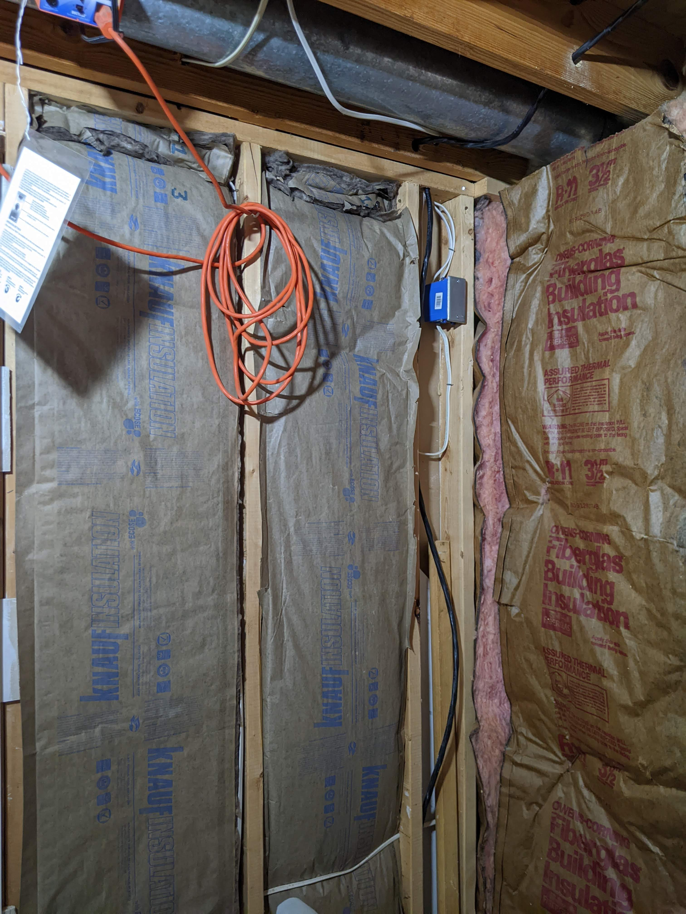

The 8/3 wire is over $5 a foot so I really didn't want to get another one in the correct longer length. I ended up learning how to splice the wires. The splicing itself was straightforward, twist the wires together with some lineman pliers and secure with a large wirenut. But I am not positive that it is up to code. I know that the splice has to happen inside a junction box that has sufficient room to hold eight 8/3 wires (neutral to neutral, ground to ground, etc.). And I know that the junction box has to be accessible. But beyond that, not sure on box placement or if the wires need to be stapled or if there is some technicality I am missing. If I don't get any feedback from a DIY community then I plan to have an electrician take a look at it. But from an immediate safety perspective, I don't have any concerns.

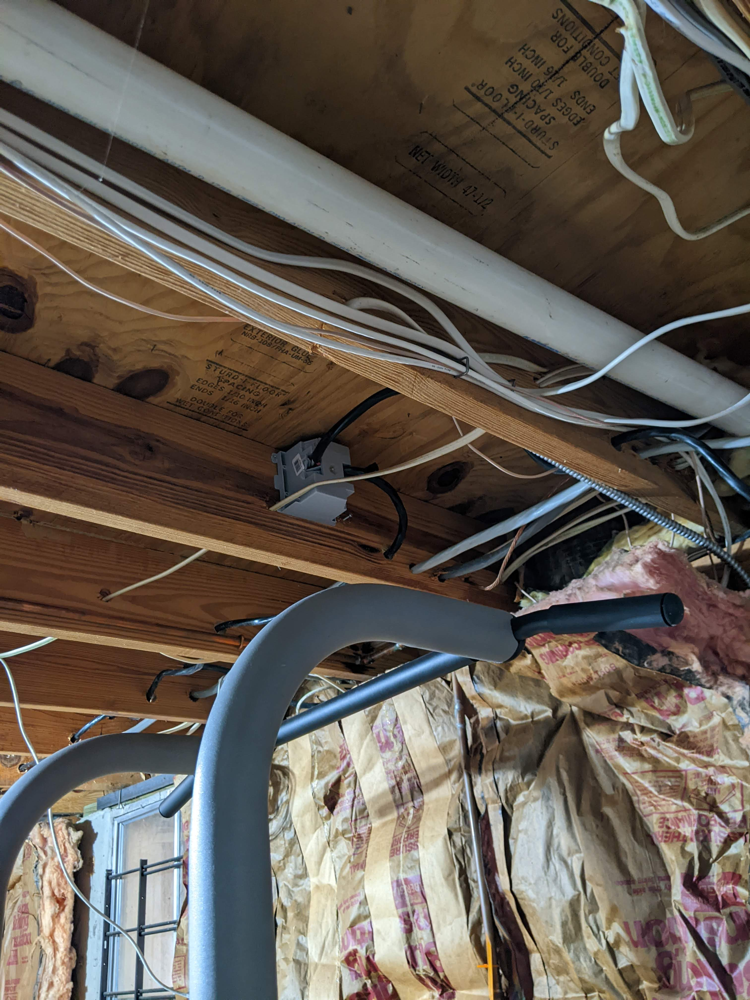

With the electrical now run, I could finally mount and test the 6KW sauna in the completed sauna interior. I was relieved to see it reached 180F quickly and felt like a 'sauna' rather than a warm room.

## Finishing touches

I added trim to the interior to cover up some of the corner gaps in the tongue and groove panelling. Trim pieces from Lowes/HD were over $1 a foot. Instead, I used 1x2 furring strips and ripped them to 1x1 in some corners so the edges matched up. I also added stick on LED lights around the bottom and used some more 'trim' directly above the lights to help diffuse it.

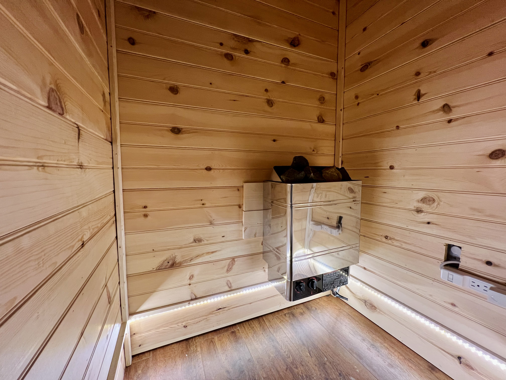

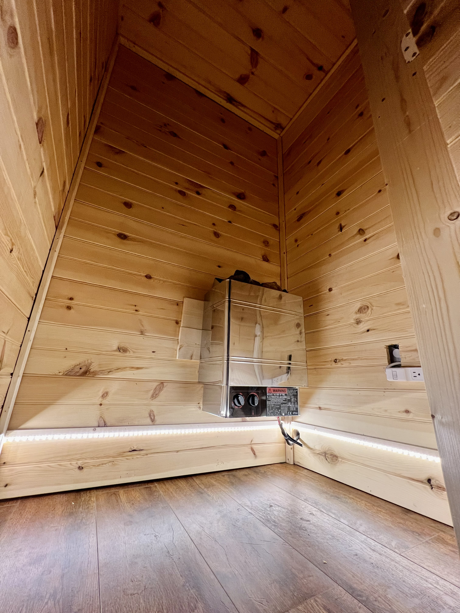

The exterior is painted to match the surrounding basement and I was able to reuse the trim from the existing corner. Getting the trim cut to the right angles for the door and the floor took longer than I expected. I think it is fun that it looks like a closet until the door is opened.

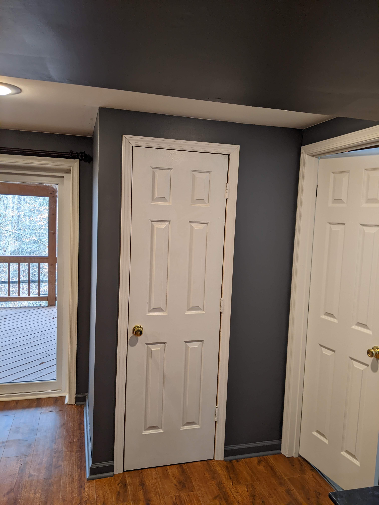

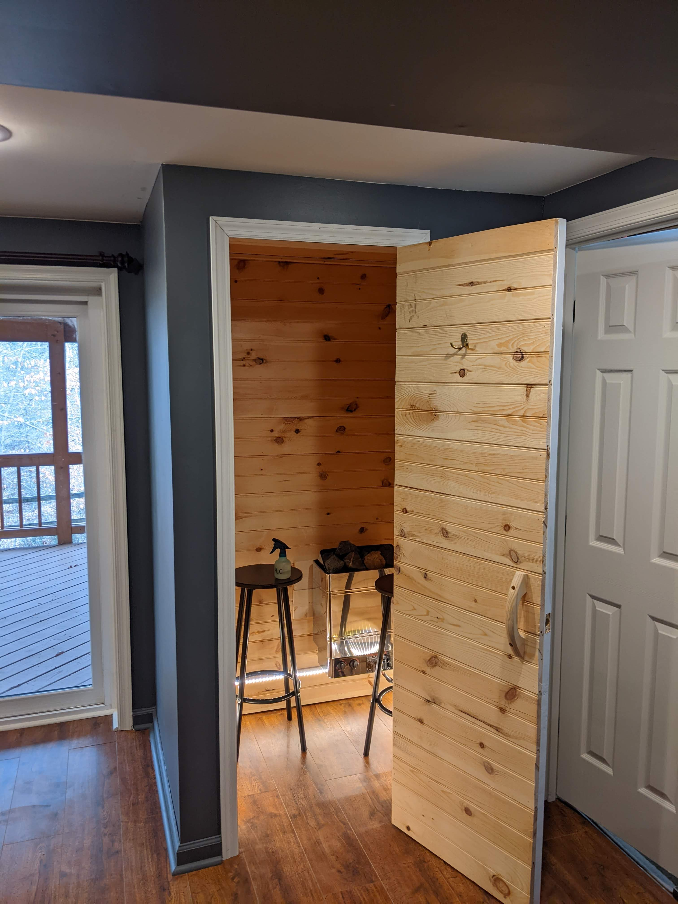

For now, I am sitting on the tall chairs. Eventually I may build in bench seating, but I like how it is easy to take the chairs out. And it is easy enough to lean back on the walls.

## Cost

I am including costs from my receipts, but am leaving out tools and supplies I already had or borrowed (thanks Dad!). If you do not have those tools, a fair amount may need to be added to the total cost, for example here is a snapshot of tools/supplies in use at time of cleanup.

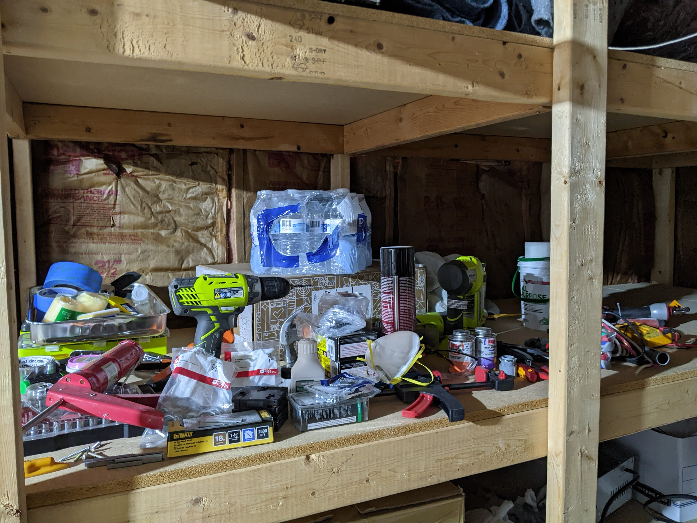

- $190 8 inch pine tongue and groove (22)
- $45 1x2x8 (16)
- $35 1x6x8 (3) 
- $60 2x4x8 (14)
- $10 construction screws
- $20 door trim
- $110 drywall tools/material
- $50 brad nailer + staples + nails
- $175 30 feet 8/3 Romex wire
- $15 paint supplies
- $35 electrical supplies
- $40 insulation
- $60 vapor barrier + foil tape
- $25 rental truck
- $50 sauna stones (you can get river rocks from HD for cheap)
- $150 sauna heater
- $20 stick on LED lights
- $10 door handles

= ~$1100

I actually spent a couple hundred dollars more than this on miscellaneous items that I ended up not needing or gambles (like the 2KW sauna...). Hopefully I will get most of that back by reselling or returns. But if you can avoid some of my mistakes and have several tools already, this ends up being a bit over $1000 and a lot of labor and learning. Not too bad when comparing against a $3500 prebuilt alternative.