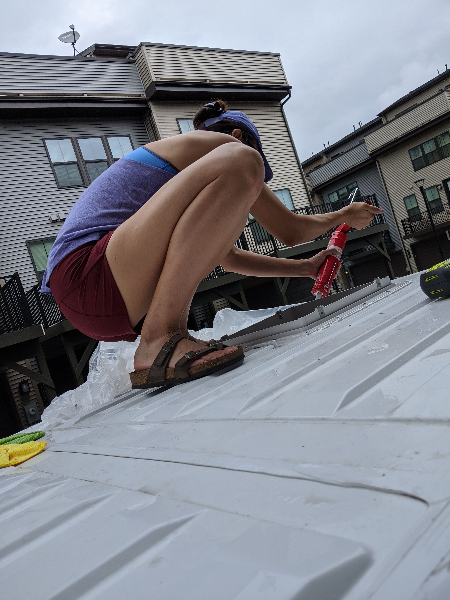
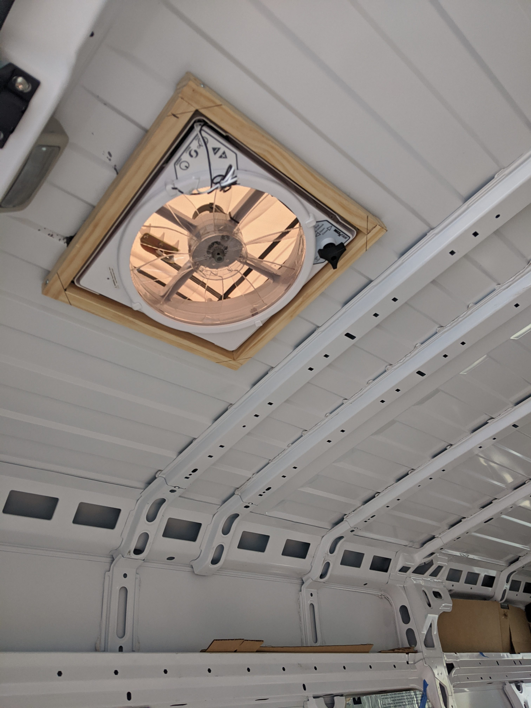

I went into this project with minimal wood working or DIY experience. Building the floor, walls, and ceiling proved to be a more difficult and involving task then it first appeared. We completed the following by working MANY hours over the course of a month and half. And by the end of it, I had made enough mistakes that I believe I could complete the same task now in half the time.

## Flooring

We decided early on that we would add insulation, if only because it would be a giant hassle to install later if we wanted it. For the floor we used a mix of 1/4" Polystyrene and 1/2" XPS foam board and for the walls and ceiling we used 1" Polyiso foam board. We chose this insulation for the best blend of R-value (this is a measurement of how well a material insulates) and price. In total we paid around $150-$200 for insulation. In retrospect, using sheeps wool as insulation would have been less toxic, easier to apply, and not terribly more expensive...but we didn't have the patience to wait for a long delivery time.

We put down the 1/4" Polystyene boards first. 1/4" is about the same height as the grooves in the floor of the Promaster, so this acted as a 'leveling' layer. 

Next, we installed 1/2" XPS boards. It was VERY tricky to cut these to fit the many curves, nooks, and crannies of the Promaster floorbed. We used cardboard templates first and cut with scissors to get as close as we could. We then used the templates to trace out the cuts on the foam board (a jigsaw is essential). Additional cuts were eyeballed. We discovered later that thick craft paper is sold in giant rolls at Home Depot and Lowes, this would have been much easier to cut for templating purposes. The majority of the time spent here was creating the templates - it takes FAR longer than you'd expect. The XPS was later attached to the van floor using silicone. 

The last layer is 1/4" plywood. I chose this thickness to try and keep as much ceiling height as possible - every 1/4" of head height counts, especially for our 6' friends. I think I should have chosen 1/2" for better stability. It is fine to walk on, but it would have been nice to have something thicker to attach the later structures (table, benches, cabinets).

Originally I picked up some particle board thinking it would be good enough. The surface of particle board is rough and would be difficult to install sheet vinyl on. So I returned it and used cheap birch plywood instead. We chose sheet vinyl based on several reports from other van conversions that vinyl tiles would flex with the car as we drove and could leak to the subfloor if spilled on. Sheet vinyl is one continuous 'sheet' and is leakproof if not ripped.

The plywood was cut using the XPS as templates and then siliconed to the XPS. Unfortunately some of the wood warped in the heat and created small gaps between the plywood pieces. I attempted to fix this with wood glue...but only created a gritty raised mound between the pieces that we later had to sand down. When we put the sheet vinyl on, the gap between the wood pieces showed through. Not a problem, but a blemish that could likely have been avoided with a thicker wood floor.

## Walls

We decided early on in the build that we did not want to use self tapping screws to attach anything to the interior frame. By avoiding screwing directly into the metal we could, if need be, remove whatever we added without leaving holes everywhere. The Promaster comes with many holes predrilled in the interior frame and intended to be used for attaching structures (typically wall coverings and storage units). I looked into buying premade kits that were designed to hook into this framing...but the price was in the thousands and was functionally targeted towards electricians or plumbers.

I found a few builds that used rivet nuts, also known as rivnuts or nutserts.  A rivet nut is a threaded insert that can be put into a metal frame to 'hold' a screw, rather than drilling the screw directly into the metal. There is something similar called a plusnut or crossnut that is essentially the same thing as a rivet nut but with a different attachment mechanism that is reputed to be more effective. We went with the rivet nuts because they were cheaper and came in metric sizes that fit the existing holes in the Promaster frame exactly. 

This is the tool used to install the rivet nuts: https://www.amazon.com/Astro-Pneumatic-Tool-1442-Setter/dp/B003TODXQW

M5 rivet nuts fit the smaller, circular holes in the frame: https://www.amazon.com/gp/product/B01J7X4ECU/ref=ppx_yo_dt_b_search_asin_title?ie=UTF8&psc=1

M8 hex rivet nuts fit the larger hexagonal holes in the frame: https://www.amazon.com/gp/product/B01MS63NZ7/ref=ppx_yo_dt_b_search_asin_title?ie=UTF8&psc=1

Matching a screw with the rivet nut size is simple - use M5 and M8 screws. The length of the screw depends on the thickness of the wood you choose, 30mm worked for most of the framing. We used 80mm for some thicker wood.

I decided to frame the walls using 1x3x8 furring strips. 1x4x8 furring strips would have been preferable, but weren't available nearby. The plan was to attach a furring strip frame to the interior frame using the rivet nuts, and then to screw 1/4" plywood sheets to the furring strip frame as the interior facing walls. Insulation (1/2" XPS) was glued directly to the metal van walls.

In order to attach the furring strips to the interior frame, we had to do the following:

- place rivet nuts in a few holes in the interior frame that aligned with where we wanted the furring strip frame to go
- line up the furring strip with the rivet nuts and drill holes through where the rivet nuts met the furring strip (we drew on the rivet nuts with a sharpie and then hit the wood against the rivet nuts to leave a mark)
- screw through the furring strip into the rivet nut insert

I encountered several difficulties here. 

Twice we encountered rivet nuts that would 'spin', trapping the screw in the nut. This happened when the rivet nut was not set correctly in its hole or when the screw was inserted at a slight angle and knocked the rivet nut loose. Dealing with a 'spinner' is an enormous pain because there is no easy way to remove the screw. All efforts to hold the spinner in place manually were futile. Eventually we gave up and used a reciprocating saw with a metal blade to cut through the screws at the base. We then left the spinner alone and tried again with another hole.

Trying to drill holes at the correct spot in the furring strip to match the rivet nut locations was an exercise in frustration. The sharpie method was hit or miss and if the hole wasn't in the exact right position then the screw would enter the rivet nut at an angle and we would risk a spinner. Towards the end I started drilling holes far larger than the screw diameter and used a large washer to make up the difference.

Finally, we were limited by the position of the predrilled holes in the frame. For the most part this wasn't an issue, but in retrospect there are a few places where it would have been easier to drill our own hole in the frame for the rivet nut to live. Also, we complicated our job by retaining the D rings in the walls (and floors). Maybe they will come in handy one day, but that day hasn't come yet.

We repeated this process for each section of the van frame.

Once the frame was up, we cut out cardboard templates to match the shape of the wall and to account for the wheel wells. We transferred the cardboard templates to sheets of 4x8 1/4" plywood sheets with a jigsaw (we cut roughly 2 feet off the top of the sheet). The sheets were attached to the frame with small screws and (thankfully) bent to the shape of the wall, curving inwards slightly. Lastly we primed and painted. The gaps between the walls are later covered by trimming. The large gap between the left walls is covered later by our shower.

## Ceiling

Before we attached a frame and covering, we added a MaxAir fan. We cut a hole in the roof with a jigsaw and metal blade (after measuring at least 50 times). We were so excited to install the fan that we didn't pay attention to the weather reports. Not long after we cut a hole in our roof it started raining. So we rushed to finish the fan installation under a plastic tarp. 

The wood frame around the fan holds it in place (it is screwed in from the top).

We followed a similar framing process with the ceiling. We used rivet nuts and furring strips followed by attaching plywood. We used 5mm plywood for the ceiling for cost savings and its lighter weight. 

When attaching the furring strips to the rivet nuts, we almost drilled our screw right through the roof. Definitely double check the screw length. 

It was a two person job attaching the plywood to the furring strips. We set the plywood pieces to meet each other halfway across the furring strip. There were two tricky cuts. One was cutting a hole to fit the fan. The other was a cut at the front of the van (right behind the front seats) as the walls bend inwards gradually. I ended up eyeballing it and it worked out ok. It is a good thing we chose a lightweight wood as the last piece towards the front of the van has nowhere to attach to...so we screwed it into the headliner and it has held without a problem so far. Running the furring strips long ways at this section might have helped somewhat, but the furring strips are so thin on their own that I don't know if it would be much more secure on that last section. 

## A finished frame

At this point we had the insulation throughout the van, walls and ceiling attached and painted, and plenty of furring strip attachment points. The furring strips will act as studs for mounting for later additions like the sink, overhead cabinets, and bench seating. I think the large pieces of plywood for the walls and ceiling work well aesthetically and the sheet vinyl looks better than expected. In our winter excursions the insulation has been helpful, but for extended winter use a heater would be necessary.

It's hard to calculate total costs as we built several other things in parallel. My best guess would be something like:

- $250 insulation
- $25 3M adhesive (for insulation)
- $15 cardboard (for templates)
- $100 plywood for floor
- $150 plywood for walls
- $80 plywood for ceilings
- $60 furring strips
- $60 sheet vinyl
- $50 sheet vinyl adhesive and trowels
- $60 rivet nut tool
- $30 rivet nuts
- $50 screws (a number of sizes)
- $350 maxx air fan (overpaid as it was out of stock almost everywhere)
- $10 rust reformer
- $15 sealant + caulk gun
- $15 butyl tape
- $10 metal filer
- $20 2x2s
- $100 jigsaw and blades
- $0 circular saw (already had it)
- $100 paint + primer + brushes + cover sheets

= ~$1550

We have several build posts to come, including building the bench/murphy bed, sink, shower/toilet, and upper cabinets.

