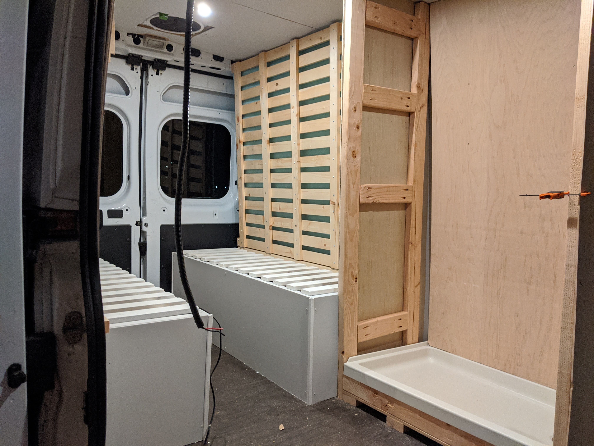
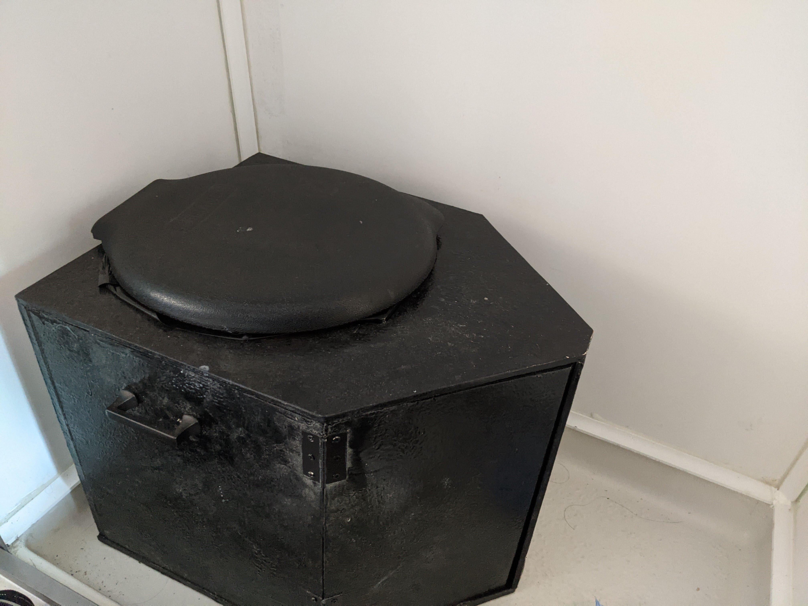

Now that we had **[insulation, walls, ceiling, and roof fan installed](../van-build-framing/)**, we were ready to add...everything else.

## Bench + Bed + Table

This could have been as simple as tossing a mattress in the back, but we wanted more storage space and lots of room to sit or lie down during the day. We also wanted room for a large table/desk so that we could both use our computers to work on the road. To make the most of the tiny space, we decided to have a bed that could lie on top of the benches at night and be hoisted out of the way during the day.

The bench was one of the first things I tried making in parallel with the insulation. I made a frame with 2x4s before realizing that the sizing was going to depend on where the walls ended and put it off for later. 

After the furring strips were attached, I had a much better idea of how long the benches could afford to be while still leaving some room in the middle to walk through. We made them with 2x2s to save weight and allow for more interior room. We left plenty of room between the slats on the top for better air flow, and the top of the bench is hinged at the back so that it can open from the top.

We closely followed **[this bench design](https://waywardgringos.com/2017/03/22/van-bed-table-construction/)**.

The next step was figuring out how to get a bed frame hinged to the bench. From wall to wall, we had about 70 inches of room. I am just under 70 inches and so this was just enough room to sleep sideways (one of the reasons **[why we picked the Promaster](../van-build-vehicle-research/)**). However, from top of the bench to the ceiling, we only had about 54 inches. So we knew that the bed frame could be at most 54 inches long. This was more than long enough to be able to rest on both benches. We made the frame a bit shorter so that the remaining length to the wall could be filled by the bench cushions we planned to add. We figured our feet wouldn't know the difference.

We made the frame with cross stitched 2x1s. We had considered using 3/4" plywood, but for weight and sizing reasons this was more flexible. We attached the frame to another set of 2x2 framing attached behind one of the benches. The hinges on the framing were set about 8 inches away from the wall so there would be room for a mattress and bedding. The hinges are attached at the end of the 2x1s

We now had to get a custom bed to fit our unusual dimensions of 70" by 64"..slightly wider and and shorter than a queen. I looked into cutting foam mattresses to size, but ran into many horror stories. It turns out that most mattresses are surrounded in a 'firesock' that helps prevent burning. The firesocks tends to be constructed of fiberglass, that if tampered or cut into will release untold numbers of sharp microscopic particles that embed themselves in your lung tissue...

Instead we custom ordered pieces of foam from foambymail.com for both the bed and the bench seat cushions. It was reasonably priced and we got all the foam we needed for under $300. For the bed, we layered a 3" harder foam with a 2" softer foam and for good measure added a 2" foam mattress topper from Amazon on top. For the bench cushions we used a firm 2" foam. We covered the bench cushions in a dark navy fabric we got from Joanne's and stapled the back to a luan board. H did her wrapping magic with the corners.

At this point, we have the benches, bench cushions, bed frame, and mattress. What we are missing is a way to hoist and secure the bed frame during the day. I had several ideas to attach the bed to the furring strips or directly to the car frame..but eventually settled on a simple alternative. We had left the car frame exposed at the corners where the wall meets the ceiling. I attached a chain and carabiner around the car frame openings and strung a paracord through the carabiner. I then fastened the carabiner to the front of the bed frame using two marine fasteners. A picture is worth a thousand words.

We also covered the frame in some fake greenery. The bed is easy to let down slowly using the paracord. It is harder to get back up and takes a bit of muscle. TBD on ideas to make it easier to lift up, but it is doable for now. And more importantly, it is quiet and secure while we are driving.

We later added some finishing touches to the benches including 1/4" plywood covers, a paint job, and some hydraulic pistons to hold up the bench automatically when lifted (well worth the $10 pistons).

The table (look back to the splash image) was one of the last additions. It was simpler than I thought it would be. The **[legs and mounts](https://www.amazon.com/gp/product/B08562XH7G/ref=ppx_od_dt_b_asin_title_s00?ie=UTF8&psc=1)** were on Amazon for ~$30.

The table itself is a piece of 2x4' 1" thick plywood wrapped in contact paper. The contact paper looked GREAT when we first applied it and has held up well (no rips) through a lot of rough handling. The table is cut so that it can lie between the benches to support the weight from the bed.  Unfortunately it has taken on a green tint from our fake greenery. Eventually we'll have to find an aesthetic alternative for the bed frame backing.

## Bathroom / Shower

One of my biggest priorities was a functional bathroom and shower. I had seen many van builds that didn't have these or had a toilet underneath a bench without even a semblance of privacy or an outdoor shower only. If two of us were going to be travelling in such tight quarters for any length of time even a bit of privacy can help. Also, with my **[recent Crohn's diagnosis](../crohns-hospitalization/)**, I wanted the comfort of knowing I had an emergency plan for #2s.

We wanted to do the shower as cheaply, quickly, and functionally as possible. Hot water heaters and water pumps weren't in the cards. Instead I found a **[battery powered shower head](https://www.amazon.com/gp/product/B07RL28B83/ref=ppx_yo_dt_b_asin_title_o06_s00?ie=UTF8&psc=1)** and **[a bucket](https://www.amazon.com/gp/product/B074ZK5K4P/ref=ppx_od_dt_b_asin_title_s00?ie=UTF8&psc=1)** on Amazon.

The shower head works much better than I expected. It comes with a head with a nozzle that allows you to selectively spray. This is a must if you want a shower with less than five gallons of water. I found I can get a thorough shower using less than two gallons of water (the average shower in the U.S. consumes ~17 gallons of water). The strategy is to rinse once, lather with soap and shampoo/conditioner, then rinse out. If you want hot water, boil some water and mix it in. It is not luxurious, but it gets the job done well and with minimum water usage. The batteries say they are good for around an hour of usage...but after ~20 showers are still going strong without a charge.

We ordered a **[shower pan](https://www.amazon.com/gp/product/B01N13LTIZ/ref=ox_sc_act_title_2?smid=ATVPDKIKX0DER&psc=1)** and **[marine shower drain](https://www.amazon.com/gp/product/B00GD8RS8U/ref=ox_sc_act_title_3?smid=ATVPDKIKX0DER&psc=1)** off Amazon. The pan is lightweight and 24"x36", more than large enough to both shower and to sit down inside for a future toilet. The drain is dead simple and fits perfectly with the pan.

We heavily referenced **[this blog](https://actsofadventure.com/van-shower/)**.

First step is to cut a drain hole. I used a **[35mm hole saw](https://www.amazon.com/gp/product/B07S1SP95B/ref=ppx_yo_dt_b_search_asin_title?ie=UTF8&psc=1)**.

Next, I added a shower base with a cut out for the drain. It is just tall enough to account for the height of the drain. Any taller and I would not be able to stand comfortably inside the shower. The frame is 1/2" plywood on top of some 2x4s and a 2x2. 

Unfortunately I didn't take very many pictures here. I put up a 2x4 frame with 1/4" plywood on the outside and inside. This was a painful and tedious process of cutting to size and accounting for the curved walls of the Promaster. In particular, the back piece was very difficult to get flush with the wall and I had to add and remove backing 1x2s to get the angles right.

Here you can see the mostly complete frame, sans interior plywood covers. I added a 2x4 piece to the base to support the lip of the shower pan. I did not otherwise need to secure the shower pan to the base as the plywood covers hemmed it in.

I attached plastic utility panels to the plywood walls using FRP adhesive. The plastic utility sheets are waterproof and cheaper than FPR boards. IMO the smooth surface also looks better than the cheaper FRP boards.

I spent an agonizing amount of time trying to make a waterproof bench with a toilet concealed underneath. Unforunately it turns out that I do not have the skill set to make a waterproof hinge and eventually had to abandon this idea. I installed a Nautilus retractable door around the same time.

We looked into several toilet ideas. A black tank system was out of the question. I didn't want to do a chemical toilet as it would involve liquid waste. Composting toilets seemed easiest. But commercial composting toilets are upwards of $700. And given that we would be on the road and passing bathrooms frequently, going #2 in the van would be for emergency use. So we decided to make our own. It was fairly simple and less than $200. 

The frame is 1/2" plywood. The bucket is 5 gallon and can be found in any hardware store. We got **[one](https://www.amazon.com/gp/product/B000FIAPXO/ref=ppx_od_dt_b_asin_title_s00?ie=UTF8&psc=1)** with a toilet seat attached.
I found a **[urine diverter](https://www.etsy.com/listing/844715096/diy-xl-compost-toilet-urine-diverter-and?ref=related-2)** on Etsy.

It was a little tricky to fit the urine diverter in the bucket as it involved cutting the rounded bucket with a jigsaw, but came out ok. And if you screw up the bucket, another one is cheap. The urine goes through a 1/2" plastic hose to the inside of a gallon jug. These are easy to empty and replace as you go, we typically had to empty every few days. We painted the plywood with FlexSeal paint to seal and waterproof. The two hinged 'doors' on the front open for easy access to the urine container. We added handles on the side for easy lifting in and out when we wanted a shower.

Last steps for shower was sealing the edges with silicone and adding some trim to help hide my terrible silicone job. We added a hanger for the shower bucket and a soap/shampoo holder.

## Kitchen + Sink + Cabinets

Having a 'full' kitchen setup was very important for us. I had been **[diagnosed with Crohn's disease](../crohns-hospitalization/)** a few months earlier and was on a very limited diet. So it was important that I was able to make my own food on the road. H took up the challenge of making a cabinet that could fit food and pots/pans storage, an oven and cooktop, and a fridge in about 3.5x2 feet...and with a recently broken foot.

We found **[a great article](https://www.wanderingwoods.org/blog/2017/10/10/sprinter-oven-how-to)** on how to install an outdoor oven/stove in a flame retardant, heat resistant way (awesome as RV stoves are several times more expensive). It consists of installing a hardboard and fire resistant material and leaving enough space for hot air to escape. In our many times using this oven/stove for over an hour at a time at up to 500 degrees in 80 degree heat...we haven't had a problem. The propane is stored underneath in 1 pound canisters behind the fridge. A single can will last us about a week of usage twice a day.

The fridge is from Costway and was pretty cheap for a car fridge at around $400. It's been good, it is a little more power hungry in the heat than I was hoping for (pulls around 70 watts when on), but if the temperature is lower 80s or below we can run it indefinitely. 

We used a 1" plywood top covered in contact paper. In retrospect, I wish we had used a laminate counter cut to size, as the heat rising from the oven has caused small pockets of air to form in the paper backing. Otherwise, it has held up fine and I we can always replace the contact paper if it gets too beat up. We later painted the drawers a light gray.

We had more space than we were expecting after adding the shower, and so had plenty of room for a large sink. We installed with the same 1" plywood top with contact paper that we used for the other cabinets. 

We added a plywood section underneath the sink for storage. The bottom of the sink holds all our fresh and gray water in 6 gallon jerry containers. We can fit five underneath, one is hooked up to the sink faucet using a marine foot pump. One is hooked up to the sink disposal using a very simple drain. Three are water reserves. When the one attached to the sink is empty, we sub out for a a reserve. With showering and dish and hand washing and drinking, we need to fill up about every 2 weeks. 

One confusion - the faucet expected a hot and cold water lines. But we had a single output from the foot pump. I ended up needing a barb connector for the foot pump hose to attach to a splitter (typically used for bidets) that could attach to the faucet lines.

**[This guide](https://vanlifecustoms.com/blog/diysink)** was very helpful for figuring out what kind of hoses and lines are needed for quick release valves.

The van now had everything we needed...except more storage space. We decided to install some cabinets overhead. We added two large cabinets above the benches and one more above the sink. The trickest part was figuring out how to mount without drilling into the van. Like in **[our framing of the walls](../van-build-framing/)**, I was able to find rivet nut locations on the side and roof. I attached 2x4s to the rivet nuts at those spots and secured 1/2" plywood panels to the 2x4s. It was difficult cutting the plywood panels to size to match the slope of the wall and ceiling while remaining as 'level' as I could manage in a van that is always tilted to some degree. Tape, paper, and cardboard was helpful to test with. Once I had one panel that fit pretty well, I used it as a template to cut out the remaining panels. 

The bottom piece and front piece were equally difficult to cut out to fit, but eventually were close enough. I attached the panels to the 2x4s using metal brackets and then to a 2x1 lip in the front and then to the bottom panel. It can hold 50 pounds without an issue, way more than we planned to put up there.

Once I had the front piece fitting ok, I cut it in half and hinged the pieces separately. This required two people, one to hold up and one to drill. I then added the pistons to hold the cabinets up. Finally, I added some marine style locks and a paint job.

The last thing I added was a 12v swivel fan hung underneath the cabinet. The wiring for the fan is behind the wall. You can see it in the far left corner.

## Electrical

We had a few things to power: fans, lights, fridge, and phones/laptops. We planned to travel as cheaply as possible so this ruled out having a reliable power hook up every night. I saw a number of very expensive builds using massive lithium batteries and solar panels/generators and inverters all bought separately and connected manually. We don't need very much power, the biggest power hog is our fridge at around 70 watts when it is cooling (it powers on and off intermittently). And I didn't want to spend a lot of time connecting several unrelated electrical components and troubleshooting.

I found a **[1000W lithium battery (Jackery)](https://www.amazon.com/Jackery-Portable-Explorer-Generator-Emergency/dp/B083KBKJ8Q/ref=sr_1_8?dchild=1&keywords=Jackery&qid=1624137936&sr=8-8)** with a built in solar generator and inverter. It has enough power to run everything we need it to for around two days in good conditions (not too hot for the fridge). 

I wanted us to have to charge externally as infrequently as possible. So I got two **[100W solar panels (Renogy)](https://www.amazon.com/Renogy-Watts-Monocrystalline-Solar-Panel/dp/B009Z6CW7O)**. I attached to the roof with VHB tape on the underside of the included brackets. I then covered the brackets with a lap sealant for waterproofing. It is surprising that the tape holds the panels down...but **[others have tried it](https://faroutride.com/solar-panels-installation/)** and I can attest that it absolutely works. We nearly drove through a hurricane in a downpour and they haven't budged.

Instead of cutting a hole in the roof for the solar panel wiring, I drilled a hole through the lighting assembly on the Promaster rear and snaked the wires in that way. I had to find a longer cord to do this, but thought it was worth it to not have another hole in the roof. The solar panels were connected in parallel using **[these connectors](https://www.amazon.com/gp/product/B00FWO3RAE/ref=ppx_yo_dt_b_search_asin_title?ie=UTF8&psc=1)**.

I snaked the wiring through the open space where the roof meets the walls. Not sure what that space is called but imagine that it is intended for wiring. 

I moved all of the wiring behind the walls and to the Jackery battery underneath the bench. Getting the wiring all to the same place and inside the wire looms was very tedious. It was especially tricky working the wire looms so that they fit inside the wall and above the plywood for the ceiling lights.

I heavily referenced several blog posts on electrical to make sure that I was using the right wiring and connectors (GnomadHome and FaroutRide being good places to start). For the solar panels I used **[12 gauge connectors](https://www.amazon.com/gp/product/B01D7VBIRC/ref=ppx_yo_dt_b_search_asin_title?ie=UTF8&psc=1)**. For the lights and fans I used **[14 gauge](https://www.amazon.com/gp/product/B01MRYMY6Z/ref=ppx_yo_dt_b_search_asin_title?ie=UTF8&psc=1)**. I used **[this tool](https://www.amazon.com/gp/product/B01KN9YUSU/ref=ppx_yo_dt_b_search_asin_title?ie=UTF8&psc=1)** for all the wire stripping and crimping. 

We had several things to wire into the battery: two fans, four lights, a fridge, two solar panels, and a standard power strip (for anything that needs a traditional plug in). The Jackery provides an Anderson input for the the solar panels, we used **[this adapter](https://www.amazon.com/gp/product/B07T3K9TND/ref=ppx_yo_dt_b_search_asin_title?ie=UTF8&psc=1)** to connect. The Jackery has only a single 12V output. However, the fans, lights, and fridge all require 12V. So we wired the 12V output to a **[fuse box](https://www.amazon.com/gp/product/B07HDYQMB5/ref=ppx_yo_dt_b_search_asin_title?ie=UTF8&psc=1)** using **[this adapter](https://www.amazon.com/gp/product/B07JBM6DWW/ref=ppx_yo_dt_b_search_asin_title?ie=UTF8&psc=1)**. We went through several of these adapters as they aren't very well made...I eventually ended up wrapping the cord in several layers of duck tape to strengthen the connection and it's been fine since. The 12V outputs are wired to the fuse box using these **[spade connectors](https://www.amazon.com/gp/product/B01B1DL4OA/ref=ppx_yo_dt_b_search_asin_title?ie=UTF8&psc=1)**. Anytime the wires needed to be joined (usually for longer length) I used these **[butt connectors](https://www.amazon.com/gp/product/B000BVZB8E/ref=ppx_yo_dt_b_search_asin_title?ie=UTF8&psc=1)**. The fridge required a **[12V receptacle](https://www.amazon.com/gp/product/B07WLMXSZ5/ref=ppx_yo_dt_b_search_asin_title?ie=UTF8&psc=1)** connected to the fuse box. The lights had to be wired in parallel (so that they could be tied to the same light switch). I used several of **[these connectors](https://www.amazon.com/gp/product/B0035R7TKO/ref=ppx_yo_dt_b_search_asin_title?ie=UTF8&psc=1)** to combine the wires together. The output for the lights attaches to a **[dimmer switch](https://www.amazon.com/gp/product/B079TGR3SG/ref=ppx_yo_dt_b_search_asin_title?ie=UTF8&th=1)** using **[this connector](https://www.amazon.com/gp/product/B00SUTYYS2/ref=ppx_yo_dt_b_search_asin_title?ie=UTF8&psc=1)**. Finally, our power strip simply plugged into the Jackery 24V output.

One of the pluses of this setup is that the Jackery can easily be taken out of the van to charge or for storage. It comes with a 12V charger that I connected with a **[20 foot extension cord](https://www.amazon.com/gp/product/B08J834DZ4/ref=ppx_yo_dt_b_search_asin_title?ie=UTF8&psc=1)** that plugs right into the Jackery. This way we can easily charge via either car battery (if cloudy and driving) or by solar. Since then, the same company has come out with an improved version at 1500W that can charge from two inputs at once...which would be well worth the additional $500 if we needed more power. The system works well as long as we aren't staying in a very warm (90+ degrees) climate. Although at 85+ degrees being in the van is unbearable anyway without air conditioning. The fridge is the biggest power draw and if it is 80 degrees or below we can go without externally charging indefinitely provided there is sun or we are driving some distance. If all else fails, we also have a **[small generator](https://www.amazon.com/gp/product/B07XZX5FTR/ref=ppx_yo_dt_b_asin_title_o06_s00?ie=UTF8&psc=1)** that fits underneath the bench when not in use. We have used it a handful of times when it has been overcast several days in a row.

## Total cost

We kept track of our purchases as we went, but it is a little difficult to correlate what purchase went with what project. However, do have a total number of all our purchases combined: a whopping $8500. If we subtract the costs associated with the previous **[post on framing](van-build-framing.md)** then it cost about $7000 for everything mentioned in this post. This is nearly double what we thought we would need to spend. Much of that cost went to the electronics and appliances (solar panels, generator, battery, fridge, fans, stove, sink, shower, etc). Another large chunk went to insulation, wood and paint. Tools comprised another big expense (saws, drills, nailguns, various attachments, screws, heads). And the biggest unforeseen cost was the sheer number of miscellaneous items needed for each project. If you are curious to see how it shook out, we have **[a spreadsheet](https://docs.google.com/spreadsheets/d/1T94QUuyrFv2GxW3bWAyLhg3scK0GRvI0kJ01vrpD-nI/edit?usp=sharing)** with links where applicable.

## The End

That sums up the majority of our work. We compressed a lot into ~3 months. Even remembering it months later is exhausting. It was a very rewarding project and we learned a lot about so many unrelated systems. In a lot of ways it was like building a miniature house. But I am thankful that the work is done...and now the documenting work is done...and I can move on to new projects.