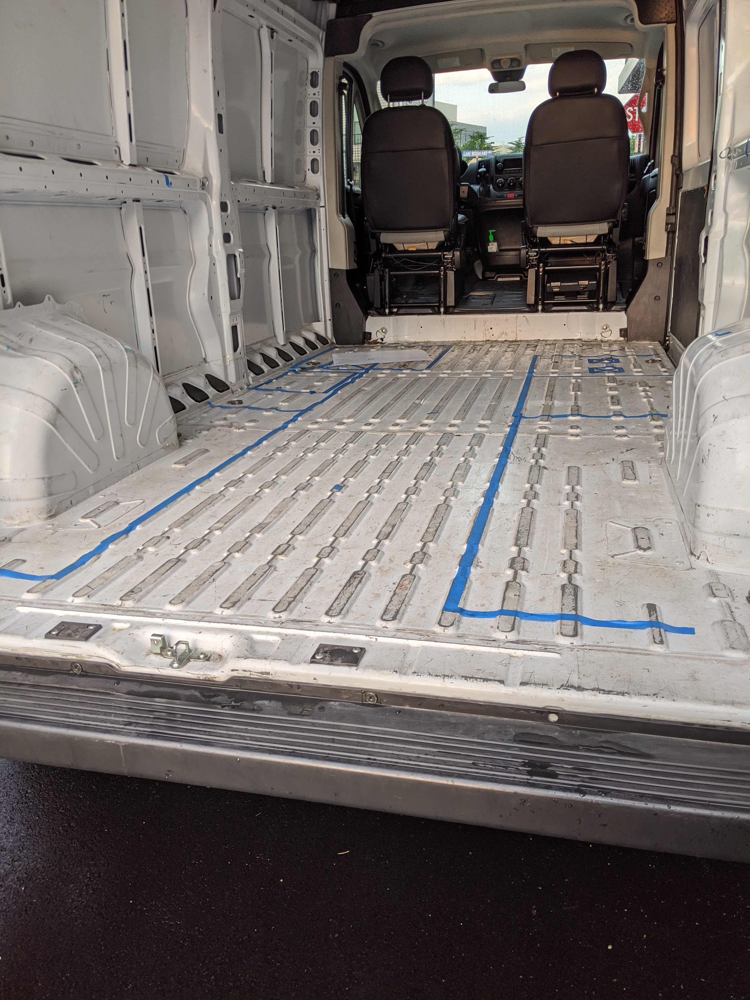

Before we decided on a vehicle we spent some time deliberating on what we wanted to fit inside a moving home/workspace. To refresh, that list included: 

- queen size bed
- stove top and oven
- refrigerator
- bench seating with a table
- sink
- shower
- toilet
- counter space
- overhead storage

I watched countless videos on YouTube for inspiration on what to do for the layout. No single video had everything, but by stealing bits and pieces from each, we came up with a mishmash that might work.

<h4 style="font-size:32px; font-family: Ubuntu;">Layout</h4>

We spent some time thinking up different configurations and drawing them out. Here is a configuration where we considered having the front seats swivel 180 degrees with a drop down table.

Later, we found an image online for the Promaster dimensions and drew over it. This was imprecise, especially since we didn't know the sizes of the components (e.g. size of the sink). So all our layouts ended up being more guidance than blueprint. 

Our plan for the bed isn't reflected in the drawings. We wanted bench seating and a large table. We also wanted a queen size bed. The only way we could think of to fit both was a murphy bed set up where the bed folds up into the wall. We were optimistic that this could be done with the height and width of the Promaster.

The first thing we did when we got the Promaster was to mark out where we thought everything would go using tape.

This was a valuable exercise, it was much easier to get a realistic sense of the space available. We found we needed ~2 feet in the aisle going down the middle of the car to be able to get around each other. 

We made changes to the layout as we built: we designated a separate counter for the sink (more room for water storage), the sink and shower switched places (so the driver seat could recline), and the murphy bed switched walls (so the shower width better matched the bench width). 

Here's a few shots of the final layout.

It was great that we were able to line up the shower with the sink and the stove/counter with the bench. Unfortunately the bench with the murphy bed sticks out a bit as the bed has to go somewhere.

After a few weeks travelling in it, I'm not sure what we would change. Really my only gripe is that it is difficult to cook with two people...but I'm not sure how we could do better there. Some things are just difficult in a tiny space, no matter what you do. One other problem is that you cannot access the bench storage when the bed is down. We plan to solve this by making access panels in the sides of the bench in addition to the swivel top. Altogther we are pleased with the way it turned out and are able to eat, sleep, and work comfortably. 

Future posts will visit more specific parts of the build, like how to build the bench/murphy bed.