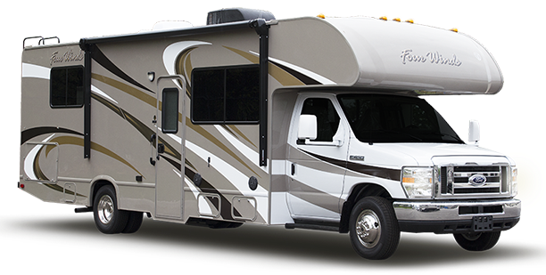

We spent about a week deciding what kind of vehicle we wanted to convert. In retrospect, a week is not a lot of time. Between the excitement of an impending cross country road trip and the pressures of completing the project while we were still working remotely, it isn't surprising that we were eager to get to work. Would we have benefitted from spending more time in the planning phase? Maybe, but in the end we were happy with our decision, even though we are more aware now of some of the pros and cons.

The first step was to figure out what we needed to be comfortable for a roadtrip, camping trip, and working remotely out of the vehicle. A mostly comprehensive list:
- queen size bed
- stove top and oven
- refrigerator
- lights
- fans
- bench seating with a table
- sink
- shower
- toilet
- battery power sufficient to power lights, fridge, fans, and computers

Some other factors we considered about prospective vehicles:
- cost
- how easy it is to park
- miles per gallon
- age + mileage
- reliability + repair costs
- resale value
- stealth
- interior dimensions
- offroad ability

An overview of some vehicle types:
- RV type A
- RV type C
- Trailer (5th wheel)
- Camper van

Here is our thought process for each vehicle type, we'll use the above factors to evaluate.

<h2 style="font-size:32px; font-family: Ubuntu;">RV type A</h2>

This is the luxury option. It has all the amenities that we want built in with plenty of space to spare. However, it does not meet our needs in most other respects.

**Cost**: By far the priciest option. Anywhere from $70-150k in the used market.  
**Parking**: Difficult. Will take up multiple spaces and be difficult to turn. Its length is a major downside as it will severely limit the number of places you can drive and park inside cities and suburbs.  
**Miles per gallon**: Abysmal. Less than 10mpg for many models.  
**Age + mileage**: Easy to find a variety of used models with low mileage.  
**Reliability + repair costs**: Tough to say with so many model options. But generally will cost more than the equivalent repair for a smaller vehicle. Depending on model parts may be more difficult to source. And with more amenities built in, there is more that can go wrong.  
**Resale value**: Not great. All vehicles depreciate fairly quickly, especially if new. The higher the purchase price, the greater the total loss to depreciation.   
**Stealth**: Non existent. Everyone will know you are camping in an RV.  
**Interior dimensions**: Great, there is lots of space for storage and all amenities are included.  
**Offroad ability**: I wouldn't want to test it.  

<h2 style="font-size:32px; font-family: Ubuntu;">RV type C</h2>

This is a scaled down version of a type A. It is a cab built on a van frame. It also has all the amenities built in, but has many of the same limitations as the type A. The comparisons are so similar I only include the differing factors.

**Cost:** Slightly less expensive than the type A. Anywhere from $30-120k in the used market.  
**Parking:** Slightly easier than the type A, depending on the model length you get.   
**Miles per gallon:** Slightly btter than the type A. Less than 10mpg for many models, other models are in the teens.  
**Offroad ability:** Slightly better than type A, again depending on the model.  

<h2 style="font-size:32px; font-family: Ubuntu;">Trailer (5th wheel)</h2>

A trailer is designed to be towed by another vehicle. These come in all kinds of sizes, but let's assume that it is around 20 feet in order to be able to house everything we want.

**Cost:** Significantly cheaper than an RV as it does not have an engine. However, unless you already have a truck, a towing vehicle will play into the total cost. They sell for as low as $20k used. Coupled with a used truck, ~$40k seems likely.  
**Parking:** Difficult. Will take up multiple spaces and be difficult to turn. I haven't driven a trailer before, so not sure if towing would be easier or more difficult than a similar length single vehicle. However, there is the ability to detach and park the trailer. You could then drive and park easily in the towing vehicle.   
**Miles per gallon:** Depends on the towing vehicle, likely in the low teens.  
**Age + mileage:** Easy to find a variety of used models, mileage is less of a problem as there aren't driving/engine parts to replace. Age and mileage of the towing vehicle have to be considered.  
**Reliability + repair costs:** It has fewer repair costs than an equivalent vehicle with driving/engine parts. Again, the model, age and mileage of the towing vehicle have to be considered.  
**Resale value:** Not sure, but assuming it will be greater than a type A or C as it has less moving parts. Another advantage is that the trailer or the towing vehicle can be sold or upgraded separately.  
**Stealth:** Non existent. Everyone will know you are camping.  
**Interior dimensions:** Great, there is lots of space for storage and all amenities are included.  

<h2 style="font-size:32px; font-family: Ubuntu;">Camper van</h2>  

This is the option we went with. I see a camper van as any vehicle that has been modified for more comfortable long term travel. It might be a passenger van, school bus, delivery vehicle, decommissioned ambulance, hatchback...whatever. There are a few companies that will professionally transform your vehicle into a recreational vehicle using either a custom design or some prefabricated designs they have come up with. But in our search, most companies had waiting lists and charged more than we were comfortable with. So the following pros/cons only take into account doing the 'transformation work' ourselves. 

**Cost:** This depends on the model vehicle and what amenities are needed. Vehicle cost is the biggest consideration, prices range from a couple thousand for an older, smaller vehicle to ~$40k for a new utility van (think Mercedes Sprinter). Transformation costs are as high as you want them to be. A rule of thumb that would have applied to us: take your estimated financial costs and double them; take your estimated labor costs (in hours) and triple them.  
**Parking:** Fairly easy. There is a learning curve to parking and manuvering a larger vehicle, but we are able to easily fit into most parking spaces.  
**Miles per gallon:** Depends on the vehicle, but will likely be in the high teens (low 20s if diesel).  
**Age + mileage:** Depends on the vehicle. If looking for a specific vehicle, it may be more difficult to find. It is relatively harder to find utility vans based on our experience. My guess is that work vehicles don't tend to be sold unless there is something wrong with them or a company goes under and its vehicles are auctioned.   
**Reliability + repair costs:** Repair costs vary between models. In general, I was not impressed with the reliability ratings for any of the models I saw online. However, some model repairs were considered to be generally more expensive than others (e.g. Mercedes).  
**Resale value:** Depends on the model. The utility vans seem to sell quickly and hold their value well (Transit, Promaster, Sprinter)  
**Stealth:** This is the only option where you might get away with camping without being noticed.   
**Interior dimensions:** Varies on the model and what you plan to put in it. We figured we could *barely* fit everything we wanted.  

The camper van came closest to checking all our boxes. We ended up narrowing our choices down to utility vans. The three most popular are the Ford Transit, the Mercedes Sprinter, and the Ram Promaster.

<h2 style="font-size:32px; font-family: Ubuntu;">Sprinter vs. Transit vs. Promaster</h2>  

We knew we wanted a fairly recent model to avoid upfront repairs and maximize resale values. We also wanted to spend under $20k.

Cost eliminated the Sprinter. It is the most expensive of the bunch and we did not see any recent models close to our range. Also, Sprinter repair costs tend to be more expensive than equivalent repairs on the other models.

The Transit cost less than the Sprinter, but was more expensive than the Promaster. It also had some inner dimensions disadvantages. Both models have high roof options, however the Transit had a smaller wheelbase option than the Promaster for the same roof height. A smaller wheelbase means less room inside. 

Also, in what turned out to be crucial to our design layout, the Promaster has a slightly larger interior width. The Promaster is just wide enough to be able to sleep sideways (provided you are under six feet). For a combination of these reasons and higher availability of the Promasters in our area, we went with the Promaster.

And so the hunt began for a Promaster van. In the next post, we'll detail how we were able to find and purchase our van and some tips for saving time and money in the process.